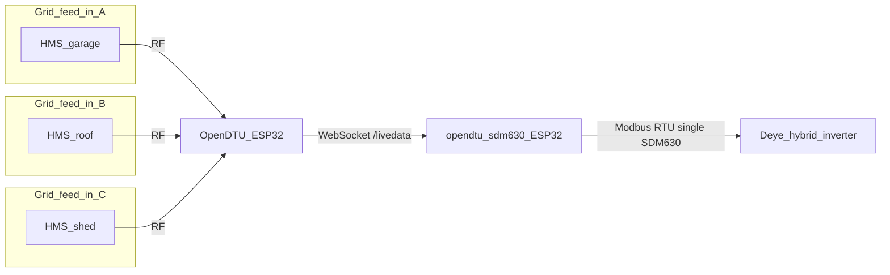
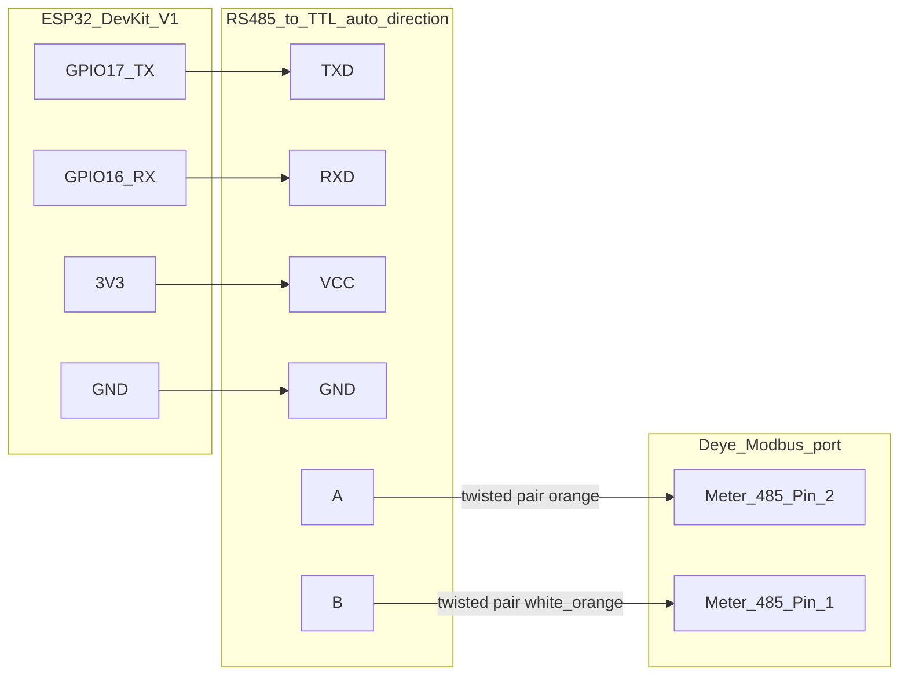

# ESPHome OpenDTU to SDM630 Component

[](LICENSE)
[](https://github.com/tbnobody/OpenDTU)

ESPHome external component that bridges [OpenDTU](https://github.com/tbnobody/OpenDTU) microinverter data to a Modbus RTU **Eastron SDM630** energy meter emulator.

## Why this project exists

This component was built to feed Hoymiles microinverter production data into a **Deye 3-phase hybrid inverter** running in **AC Couple** mode with microinverters on load side.

In AC Couple on Load Side mode, Deye needs an **Eastron SDM630** meter on its Meter-485 Modbus port to report **PV production** correctly and to measure **household energy consumption** accurately.

Instead of installing a physical SDM630 at address `0x02`, this bridge:

- Reads live production data from **OpenDTU** over **WebSocket** (`/livedata`) as often as OpenDTU publishes it (up to once per second, depending on the OpenDTU poll interval)
- Maps each microinverter to the correct grid phase (L1/L2/L3)
- Exposes the result as an **SDM630 Modbus slave** for the Deye inverter

That gives Deye accurate PV production accounting without affecting OpenDTU operation - OpenDTU continues to poll and manage all microinverters as before, while this bridge only subscribes to the livedata stream.

The WebSocket path is efficient and fast enough for correct energy totals and to avoid negative household consumption readings in AC couple on load side setup.

The component was designed for this use case, but it may also work with other equipment that reads an Eastron SDM630 over Modbus RTU.

### Multiple microinverters, one meter

A physical **Eastron SDM630** can only be wired to **one** point on your installation. That becomes a real limitation when you run **several microinverters** spread across the property — for example on a garage and a main building - each fed from a **different grid connection point**. You cannot place one meter at every feed-in location and still present a single Eastron device to the Deye inverter.

**OpenDTU** already collects production from every microinverter it can reach over the air. This bridge reads all of them from OpenDTU livedata, maps each inverter to the correct grid phase, and **aggregates** the values into one SDM630 register set for the inverter. As long as a microinverter appears in OpenDTU, you can include it in `microinverter_map` and pass its data to Deye in AC Couple on Load Side mode - without extra meters or RS485 wiring across the site.

## Tested setup

| Layer | Details |
|-------|---------|
| OpenDTU | [tbnobody/OpenDTU](https://github.com/tbnobody/OpenDTU) **v26.3.30**, Poll Interval **1 s** (DTU Settings), on **ESP32 DevKit V1** |
| Microinverters | Hoymiles **HMS-2000-4T** and **HMS-1600-4T**, each on a separate grid phase (3-phase supply) |
| Deye inverter | **SUN-12K-SG04LP3-EU**, firmware **1172**; Grid Tie Meter 2 enabled, energy meter type **Eastron** (Advanced Settings); polls Grid Tie Meter 2 at fixed address **`0x02`** |
| This bridge | **ESP32 DevKit V1**, **RS485-to-TTL auto-direction** converter; `slave_address: 0x02` to match Deye Grid Tie Meter 2 |

Deye uses **fixed Modbus slave addresses** - they are not configurable in the inverter menu:

| Address | Role |
|---------|-----------|
| `0x01` | Main / grid energy meter |
| `0x02` | Grid Tie Meter 2 (AC Couple PV production correction) |

For AC Couple on Load Side with **Grid Tie Meter 2** enabled, Deye always polls **`0x02`** for microinverter production data. The emulated meter must answer on that address; you cannot pick another slave ID and expect Deye to follow. Deye may also scan **`0x01`** for the primary meter.

## Requirements

> **Current scope:** Only **single-phase Hoymiles** microinverters managed by OpenDTU are supported at this time.

- [OpenDTU](https://github.com/tbnobody/OpenDTU) running and reachable on your network (WebSocket `/livedata`, dashboard password), with **single-phase Hoymiles** microinverters
- A **second ESP32** for this bridge (separate from the OpenDTU ESP32 in the tested setup)
- RS485-to-TTL converter (no DE/RE pin required in the tested setup)
- ESPHome **≥ 2025.6.0**
- Reader device configured for **Eastron SDM630** over Modbus RTU (**9600 8N1**)
- **Home Assistant is not required** - ESPHome alone is enough to build, flash, and run this component

## How it works



Each microinverter only needs radio reach to **OpenDTU** — not a cable run to the inverter or a shared RS485 bus. The bridge merges per-phase values from every mapped inverter before Deye reads one emulated meter.

- Parses OpenDTU livedata JSON (`inverters[].AC["0"]` → voltage, current, power, frequency)
- Maps microinverters to grid phases via `microinverter_map` (several inverters can share a phase; current and power are summed)
- Inverts current and power sign (OpenDTU reports positive production; SDM630 export is negative)
- Serves the full SDM630 input register buffer on `slave_address` (`0x02` for Deye Grid Tie Meter 2); silently ignores Deye queries to `0x01` (main meter address)

## Wiring



Connect the inverter with a standard twisted pair. From the RS485 converter, use only **A** (orange) and **B** (white-orange) to the inverter Modbus terminals. Connect ESP32 **GPIO17 → TXD**, **GPIO16 → RXD**, **3V3 → VCC**, **GND → GND** on the converter. Some modules label the same pins **DI**/**RO** instead of **TXD**/**RXD**.

The tested setup uses an auto-direction module - no `flow_control_pin` needed. If your converter requires DE/RE control, uncomment and set `flow_control_pin` under the `modbus:` block in your YAML.

## Configuration reference

All options under `opendtu_sdm630:`:

| Option | Required | Default | Purpose |
|--------|----------|---------|---------|
| `host` | yes | - | OpenDTU IP address or hostname |
| `password` | yes | - | OpenDTU dashboard password (`!secret`) |
| `modbus_id` | yes | - | ESPHome `modbus:` hub ID (`role: server`) |
| `microinverter_map` | yes | - | Map microinverters to grid phases |
| `port` | no | `80` | OpenDTU HTTP port |
| `path` | no | `/livedata` | WebSocket path |
| `username` | no | `admin` | WebSocket authentication username |
| `slave_address` | no | `0x02` | Modbus slave address of the emulated SDM630 |
| `data_timeout` | no | `15s` | Stale-data threshold before fallback values are used |
| `default_voltage` | no | `230.0` | Fallback voltage per phase [V] |
| `default_frequency` | no | `50.0` | Fallback grid frequency [Hz] |
| `publish_sensors` | no | `true` | Publish ESPHome entities for monitoring |

### microinverter_map

Each entry requires `grid_phase` (`1` = L1, `2` = L2, `3` = L3) and **exactly one** identifier:

- `name` - microinverter name from OpenDTU livedata (recommended)
- `index` - position in the `inverters` array from livedata

`name` and `index` cannot be used in the same entry.

`grid_phase` is the **grid phase on the SDM630 meter**, not the number of AC outputs on the microinverter. Multiple microinverters on the same phase: **current and power are summed**, **voltage is averaged**. Grid frequency is averaged across all mapped microinverters; if unavailable, `default_frequency` is used.

Example:

```yaml
opendtu_sdm630:
  host: 192.168.1.50
  password: !secret opendtu_password
  modbus_id: modbus_1
  slave_address: 0x02
  microinverter_map:
    - name: Garage-HMS-2000-4T
      grid_phase: 1
    - name: Roof-HMS-1600-4T
      grid_phase: 2
```

### Auto-created entities

When `publish_sensors: true` (default), the component registers:

- L1/L2/L3 voltage, current, and power sensors
- Total power and frequency sensors
- **WebSocket Status** and **WebSocket Data Valid** (diagnostic binary sensors)
- **Board Restart** button and **Component Version** text sensor (diagnostic)

Set `publish_sensors: false` if you only need Modbus output and no Home Assistant entities.

Individual sensor names and options can be overridden inside the `opendtu_sdm630:` block.

### Failsafe behaviour

When the WebSocket disconnects, JSON parsing fails, or no fresh data arrives within `data_timeout`, **power and current on all phases are set to 0.0**. Voltage falls back to `default_voltage` and frequency to `default_frequency`. Phases without a mapped microinverter always report 0.0 for power and current.

### Modbus registers

Active input registers (FP32, high word first). All other addresses return `0.0`.

| Address | Value |
|---------|-------|
| 0x0000 | Voltage L1 [V] |
| 0x0002 | Voltage L2 [V] |
| 0x0004 | Voltage L3 [V] |
| 0x0006 | Current L1 [A] |
| 0x0008 | Current L2 [A] |
| 0x000A | Current L3 [A] |
| 0x000C | Active Power L1 [W] |
| 0x000E | Active Power L2 [W] |
| 0x0010 | Active Power L3 [W] |
| 0x0034 | Total Active Power [W] |
| 0x0046 | Frequency [Hz] |

## secrets.yaml

1. Copy [`secrets.yaml.example`](secrets.yaml.example) to `secrets.yaml` in the same directory as your ESPHome YAML.
2. Fill in the four keys:

   ```yaml
   wifi_ssid: "YourWiFiSSID"
   wifi_password: "YourWiFiPassword"
   opendtu_password: "OpenDTUDashboardPassword"
   ota_password: "OTAPasswordForDevice"
   ```

3. Reference secrets in your YAML with `!secret`, for example `password: !secret opendtu_password`.

Never commit `secrets.yaml` - it is listed in [`.gitignore`](.gitignore).

## Using opendtu_sdm630.yaml

[`opendtu_sdm630.yaml`](opendtu_sdm630.yaml) is a **reference configuration** and a practical starting point. In most cases you will:

- Copy it as-is and adjust `host`, `microinverter_map`, and UART pins for your installation, or
- Merge its `opendtu_sdm630:`, `uart:`, and `modbus:` sections into an existing ESPHome device config.

The reference file pulls the component from GitHub:

```yaml
external_components:
  - source: github://Lewa-Reka/esphome-opendtu-to-sdm630@main
    components: [opendtu_sdm630]
```

It also includes WiFi, OTA, API, UART (TX=17, RX=16, 9600 baud), Modbus server, and optional diagnostic sensors. You only need to add or change what differs on your site.

For local component development, point `external_components` to a local path instead:

```yaml
external_components:
  - source:
      type: local
      path: components
    components: [opendtu_sdm630]
```

## Installation

Home Assistant is **optional**. You only need ESPHome to compile, flash, and update the firmware.

### Method 1: Home Assistant ESPHome add-on

1. Install the **ESPHome** add-on from the Home Assistant add-on store and open the dashboard.
2. Click **+ New Device**, name the device, select **ESP32**, and skip the template wizard.
3. Create `secrets.yaml` in your ESPHome config directory (see above).
4. Edit the new device and **replace its content** with [`opendtu_sdm630.yaml`](opendtu_sdm630.yaml), adjusted for your network and microinverters.
5. Click **Install**, connect the ESP32 via USB, select the serial port, and flash.
6. Wire the RS485 converter to the Deye Modbus port and power the ESP32.

The device will run independently of Home Assistant. HA is only used here as a convenient ESPHome UI.

### Method 2: ESPHome CLI

```bash
pip install esphome
cp secrets.yaml.example secrets.yaml   # edit before flashing
esphome run opendtu_sdm630.yaml
```

Useful follow-up commands:

```bash
esphome compile opendtu_sdm630.yaml
esphome upload opendtu_sdm630.yaml
esphome logs opendtu_sdm630.yaml
```

OTA updates work through the ESPHome dashboard or `esphome upload` over the network after the first flash.

## License

Licensed under the Apache License, Version 2.0. See [LICENSE](LICENSE) for the full text.
