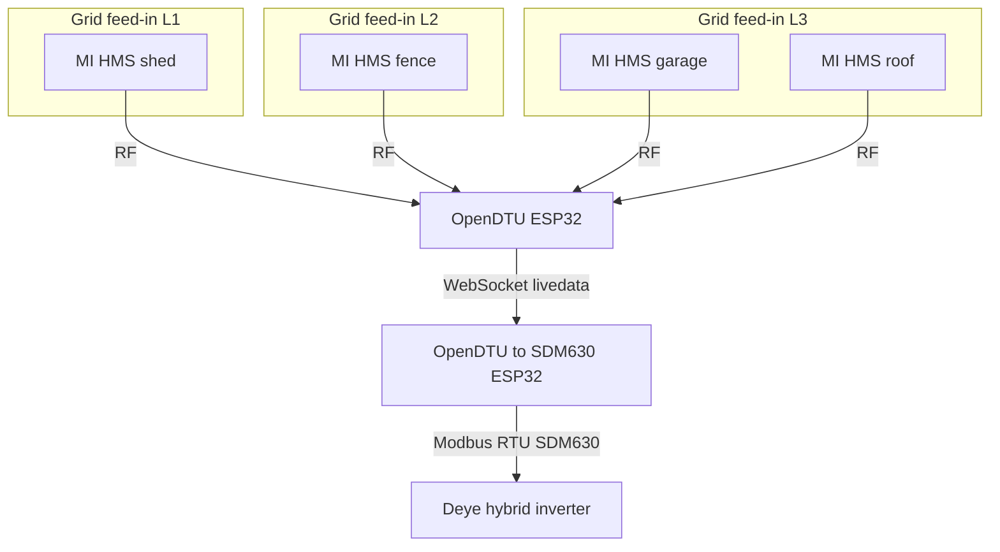
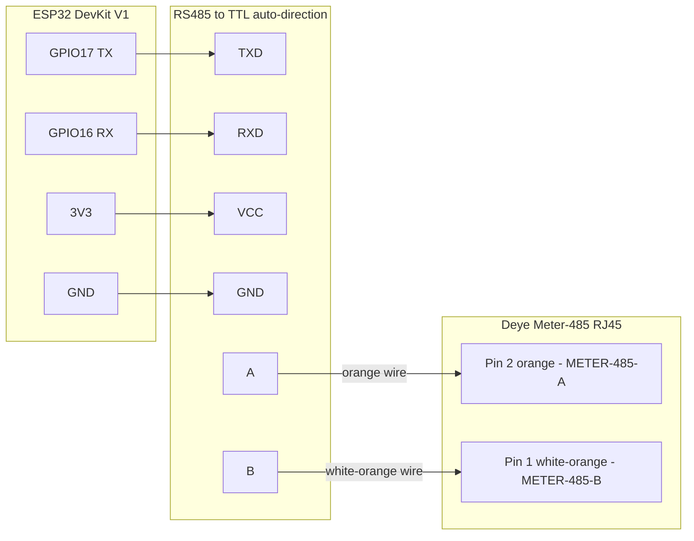

# ESPHome OpenDTU to SDM630 Component

<!--
SPDX-License-Identifier: Apache-2.0

Licensed under the Apache License, Version 2.0 (the "License"),
you may not use this file except in compliance with the License.
You may obtain a copy of the License at

    http://www.apache.org/licenses/LICENSE-2.0

Unless required by applicable law or agreed to in writing, software
distributed under the License is distributed on an "AS IS" BASIS,
WITHOUT WARRANTIES OR CONDITIONS OF ANY KIND, either express or implied.
See the License for the specific language governing permissions and
limitations under the License.
-->


ESPHome external component that reads Hoymiles microinverters data from [OpenDTU](https://github.com/tbnobody/OpenDTU) and presents it to a hybrid inverter as a Modbus RTU **Eastron SDM630** energy meter.

> **Note:** It was developed and tested with Deye, but any **Modbus master** expecting an **Eastron SDM630** (another hybrid inverter, EMS, or data logger) may work if it uses the same register map.

## Why this project exists

This component was built for **Deye 3-phase hybrid inverters** in **AC Couple on Load Side** mode - when additional Hoymiles microinverters inject PV on the load side, separate from the inverter's own MPPT strings.

In that mode Deye needs an **Eastron SDM630** at the **AC Couple coupling point** to measure how much power the microinverters inject into the installation. The inverter uses those per-phase values to separate **AC-coupled PV generation** from **grid import/export** and to calculate **household load** correctly. A physical meter is installed on the **AC conductors where the microinverter system ties into the grid**, with readings delivered over the **Meter-485** Modbus port.

Instead of mounting that physical SDM630 on the AC cabling, this bridge:

- Uses **OpenDTU** for **wireless** communication with Hoymiles microinverters - no RS485 or extra meter wiring across the site
- Aggregates **AC-coupled PV** from **many microinverters** at **different coupling points** into one emulated SDM630 - Deye exposes only **one** Eastron meter interface on Meter-485, so you cannot wire a separate meter at each distant feed-in. OpenDTU radio reach plus this bridge can still combine them
- Reads live data from OpenDTU over **WebSocket** (`/livedata`) as often as OpenDTU publishes it (up to once per second, depending on the OpenDTU poll interval)
- Maps each microinverter to the correct grid phase (L1/L2/L3)
- Exposes the result as an **SDM630 Modbus slave** on the Deye Meter-485 port

That lets Deye **meter AC-coupled PV generation** and **calculate household load** correctly - without affecting OpenDTU operation. OpenDTU continues to poll and manage all microinverters as before, this bridge only subscribes to the livedata stream. Frequent livedata updates (up to once per second) keep instantaneous power and energy counters aligned with the microinverters. Without correct coupled-PV metering, household load can read as **negative** or **no consumption at all** while microinverters are producing - on some Deye firmware/settings negative values are simply clamped to zero rather than displayed.

## How it works



Each microinverter (**MI**) only needs radio reach to **OpenDTU**. The bridge sums per-phase active power and current from every mapped inverter into the single SDM630 register image that an inverter polls.

- Parses OpenDTU livedata JSON (`inverters[].AC["0"]` → voltage, current, power, frequency)
- Maps microinverters to grid phases via `microinverter_map` (several inverters can share a phase, current and power are summed)
- Inverts current and power sign (OpenDTU reports positive generation, the SDM630 presents export as negative values)
- Serves the full SDM630 input register buffer on `slave_address` (`0x02` for Deye Grid Tie Meter 2), silently ignores Deye queries to `0x01` (main meter address)

## Requirements

> **Current scope:** Only **single-phase Hoymiles** microinverters managed by OpenDTU are supported at this time.

- [OpenDTU](https://github.com/tbnobody/OpenDTU) running and reachable on your network (WebSocket `/livedata`, dashboard password), with **single-phase Hoymiles** microinverters
- A **second ESP32** for this bridge (separate from the OpenDTU ESP32 in the tested setup)
- RS485-to-TTL converter (no DE/RE pin required in the tested setup)
- ESPHome **≥ 2025.6.0**
- **Modbus master** (e.g. Deye hybrid inverter with Grid Tie Meter 2 / Eastron type) reading **Eastron SDM630** over Modbus RTU (**9600 8N1**)
- **Home Assistant is not required** - ESPHome alone is enough to build, flash, and run this component

## Tested setup

| Layer | Details |
|-------|---------|
| OpenDTU | [tbnobody/OpenDTU](https://github.com/tbnobody/OpenDTU) **v26.3.30**, Poll Interval **1 s** (DTU Settings), on **ESP32 DevKit V1** |
| Microinverters | Hoymiles **HMS-2000-4T** and **HMS-1600-4T**, each on a separate grid phase (3-phase supply) |
| Deye inverter | **SUN-12K-SG04LP3-EU**, firmware **1172**, Grid Tie Meter 2 enabled, energy meter type **Eastron** (Advanced Settings), polls Grid Tie Meter 2 at fixed address **`0x02`** |
| This bridge | **ESP32 DevKit V1**, **RS485-to-TTL auto-direction** converter, `slave_address: 0x02` to match Deye Grid Tie Meter 2 |

Deye uses **fixed Modbus slave addresses** - they are not configurable in the inverter menu:

| Address | Role |
|---------|-----------|
| `0x01` | Main / grid energy meter |
| `0x02` | Grid Tie Meter 2 (AC-coupled PV measurement) |

For AC Couple on Load Side with **Grid Tie Meter 2** enabled, Deye polls **`0x02`** for per-phase power and energy from the coupled microinverter system. The emulated meter must answer on that address - Deye does not allow choosing a different slave ID. Deye may also scan **`0x01`** for the main grid-side meter.

## Wiring



Connect the inverter with a standard twisted pair. From the RS485 converter, use only **A** (orange) and **B** (white-orange) to the inverter Modbus terminals. Connect ESP32 **GPIO17 → TXD**, **GPIO16 → RXD**, **3V3 → VCC**, **GND → GND** on the converter. Some modules label the same pins **DI**/**RO** instead of **TXD**/**RXD**.

The tested setup uses an auto-direction module - no `flow_control_pin` needed. If your converter requires DE/RE control, uncomment and set `flow_control_pin` under the `modbus:` block in your YAML.

## Configuration reference

All options under `opendtu_sdm630:`:

| Option | Required | Default | Purpose |
|--------|----------|---------|---------|
| `host` | yes | - | OpenDTU IP address or hostname |
| `password` | yes | - | OpenDTU dashboard password (`!secret`) |
| `modbus_id` | yes | - | ESPHome `modbus:` hub ID (`role: server`) |
| `microinverter_map` | yes | - | Map microinverters to grid phases |
| `port` | no | `80` | OpenDTU HTTP port |
| `path` | no | `/livedata` | WebSocket path |
| `username` | no | `admin` | WebSocket authentication username |
| `slave_address` | no | `0x02` | Modbus slave address of the emulated SDM630 |
| `data_timeout` | no | `15s` | Stale-data threshold before fallback values are used |
| `default_voltage` | no | `230.0` | Fallback voltage per phase [V] |
| `default_frequency` | no | `50.0` | Fallback grid frequency [Hz] |
| `publish_sensors` | no | `true` | Publish ESPHome entities for monitoring |

### microinverter_map

Each entry requires `grid_phase` (`1` = L1, `2` = L2, `3` = L3) and **exactly one** identifier:

- `serial` - microinverter serial from OpenDTU livedata (`inverters[].serial`), stable if you rename the inverter in OpenDTU
- `name` - microinverter name from OpenDTU livedata (`inverters[].name`)

`serial` and `name` cannot be used in the same entry.

`grid_phase` is the **installation phase (L1/L2/L3)** where that microinverter's AC output contributes to coupled PV. Multiple microinverters on the same phase: **active current and power are summed**, **voltage is averaged**. Grid frequency is averaged across mapped microinverters, if unavailable, `default_frequency` is used.

Example:

```yaml
opendtu_sdm630:
  host: 192.168.1.50
  password: !secret opendtu_password
  modbus_id: modbus_1
  slave_address: 0x02
  microinverter_map:
    - name: "Garage-HMS-2000-4T"
      grid_phase: 1
    - serial: "123456789012"
      grid_phase: 2
```

### Auto-created entities

When `publish_sensors: true` (default), the component registers:

- L1/L2/L3 voltage, current, and power sensors
- Total power and frequency sensors
- **WebSocket Status** and **WebSocket Data Valid** (diagnostic binary sensors)
- **Board Restart** button and **Component Version** text sensor (diagnostic)

Set `publish_sensors: false` if you only need Modbus output and no Home Assistant entities.

Individual sensor names and options can be overridden inside the `opendtu_sdm630:` block.

### Failsafe behaviour

When the WebSocket disconnects, JSON parsing fails, or no fresh data arrives within `data_timeout`, the bridge reports **zero coupled PV** - active power and current on all phases are set to `0.0`. Voltage falls back to `default_voltage` and frequency to `default_frequency`. Phases without a mapped microinverter always report `0.0` for power and current.

### Modbus registers

Active input registers (FP32, high word first). All other addresses return `0.0`.

| Address | Value |
|---------|-------|
| 0x0000 | Voltage L1 [V] |
| 0x0002 | Voltage L2 [V] |
| 0x0004 | Voltage L3 [V] |
| 0x0006 | Current L1 [A] |
| 0x0008 | Current L2 [A] |
| 0x000A | Current L3 [A] |
| 0x000C | Active Power L1 [W] |
| 0x000E | Active Power L2 [W] |
| 0x0010 | Active Power L3 [W] |
| 0x0034 | Total Active Power [W] |
| 0x0046 | Frequency [Hz] |

## secrets.yaml

1. Copy [`secrets.yaml.example`](secrets.yaml.example) to `secrets.yaml` in the same directory as your ESPHome YAML.
2. Fill in the four keys:

   ```yaml
   wifi_ssid: "YourWiFiSSID"
   wifi_password: "YourWiFiPassword"
   opendtu_password: "OpenDTUDashboardPassword"
   ota_password: "OTAPasswordForDevice"
   ```

3. Reference secrets in your YAML with `!secret`, for example `password: !secret opendtu_password`.

Never commit `secrets.yaml` - it is listed in [`.gitignore`](.gitignore).

## Using opendtu_sdm630.yaml

[`opendtu_sdm630.yaml`](opendtu_sdm630.yaml) is a **reference configuration** and a practical starting point. In most cases you will:

- Copy it as-is and adjust `host`, `microinverter_map`, and UART pins for your installation, or
- Merge its `opendtu_sdm630:`, `uart:`, and `modbus:` sections into an existing ESPHome device config.

The reference file pulls the component from GitHub:

```yaml
external_components:
  - source: github://Lewa-Reka/esphome-opendtu-to-sdm630@main
    components: [opendtu_sdm630]
```

It also includes WiFi, OTA, API, UART (TX=17, RX=16, 9600 baud), Modbus server, and optional diagnostic sensors. You only need to add or change what differs on your site.

For local component development, point `external_components` to a local path instead:

```yaml
external_components:
  - source:
      type: local
      path: components
    components: [opendtu_sdm630]
```

## Installation

Home Assistant is **optional**. You only need ESPHome to compile, flash, and update the firmware.

### Method 1: Home Assistant ESPHome add-on

1. Install the **ESPHome** add-on from the Home Assistant add-on store and open the dashboard.
2. Click **+ New Device**, name the device, select **ESP32**, and skip the template wizard.
3. Create `secrets.yaml` in your ESPHome config directory (see above).
4. Edit the new device and **replace its content** with [`opendtu_sdm630.yaml`](opendtu_sdm630.yaml), adjusted for your network and microinverters.
5. Click **Install**, connect the ESP32 via USB, select the serial port, and flash.
6. Wire the RS485 converter to the Deye Modbus port and power the ESP32.

The device will run independently of Home Assistant. HA is only used here as a convenient ESPHome UI.

### Method 2: ESPHome CLI

```bash
pip install esphome
cp secrets.yaml.example secrets.yaml   # edit before flashing
esphome run opendtu_sdm630.yaml
```

Useful follow-up commands:

```bash
esphome compile opendtu_sdm630.yaml
esphome upload opendtu_sdm630.yaml
esphome logs opendtu_sdm630.yaml
```

OTA updates work through the ESPHome dashboard or `esphome upload` over the network after the first flash.

## License

This project is licensed under the Apache License 2.0 - see the [LICENSE](LICENSE) file for details.

### Copyright Notice

```
Copyright 2026 Lewa-Reka <lewareka.yt@gmail.com>

Licensed under the Apache License, Version 2.0 (the "License"),
you may not use this file except in compliance with the License.
You may obtain a copy of the License at

    http://www.apache.org/licenses/LICENSE-2.0

Unless required by applicable law or agreed to in writing, software
distributed under the License is distributed on an "AS IS" BASIS,
WITHOUT WARRANTIES OR CONDITIONS OF ANY KIND, either express or implied.
See the License for the specific language governing permissions and
limitations under the License.
```

### Third-Party Components

This project uses ESPHome and related components. Please refer to the [NOTICE](NOTICE) file for additional license information.
